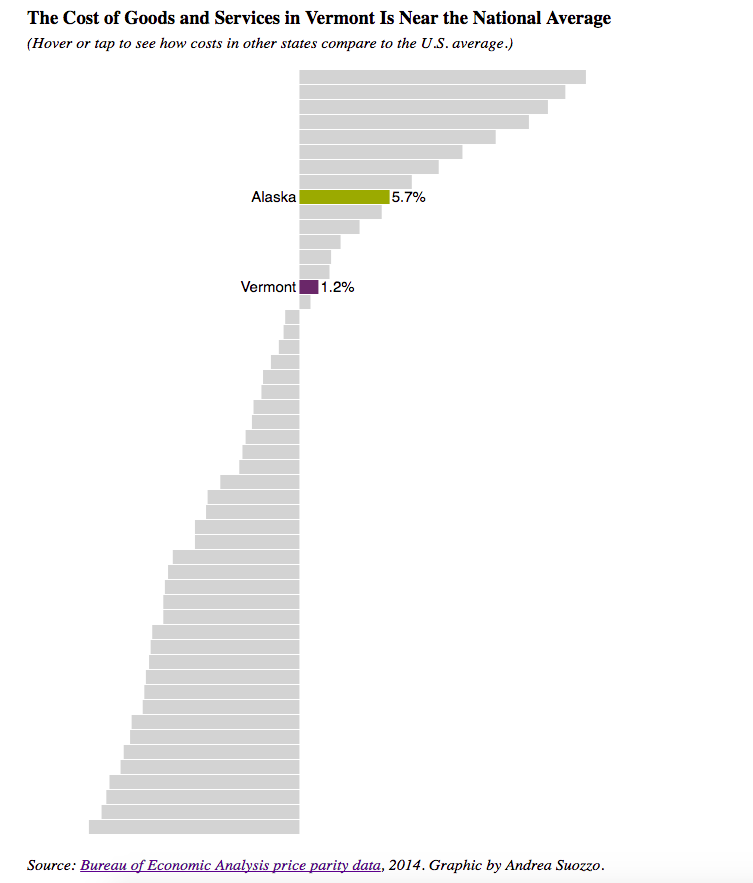

A D3 chart comparing the average prices of goods and services across 50 states, using 2014 data from the Bureau of Economic Analysis. Appears in the Seven Days story "[Afford-Ability: Can Gov. Phil Scott Deliver a Bigger Slice of the Pie?](http://www.sevendaysvt.com/vermont/afford-ability-can-gov-phil-scott-deliver-a-bigger-slice-of-the-pie/Content?oid=3944128)."

Screenshot:

