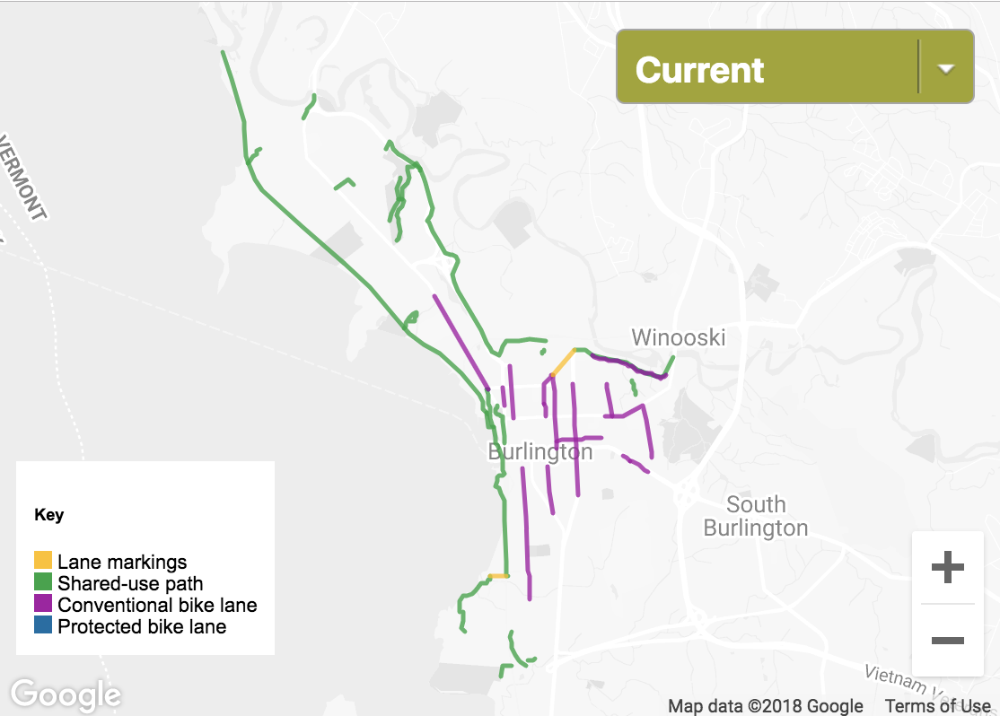

A map of Burlington's current bike lane infrastructure, as well as planned five-year and long-term additions. The user can toggle the dropdown to see the planned additions to city roads. The map originally appeared on the story "[Backpedaling: Burlington Residents Challenge Plans for More Bike Lanes](https://www.sevendaysvt.com/vermont/backpedaling-burlington-residents-challenge-plans-for-more-bike-lanes/Content?oid=7104508)."

Data source: PlanBTV Walk/Bike Master Plan

Screenshot:

