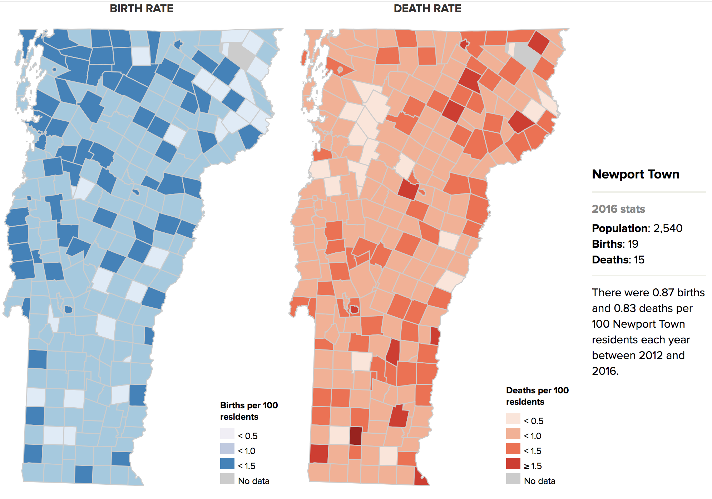

A map of birth and death rates, averaged over five years, for all Vermont towns. Users can hover or tap to learn more about each town. This map originally appeared on the story "[How the Green Mountain 'Baby Bust' Is Changing One Vermont Town ](https://www.sevendaysvt.com/vermont/how-the-green-mountain-baby-bust-is-changing-one-vermont-town/Content?oid=23940899)."

Data source: Vermont Department of Health, Vermont Center for Geographic Information

Screenshot:

