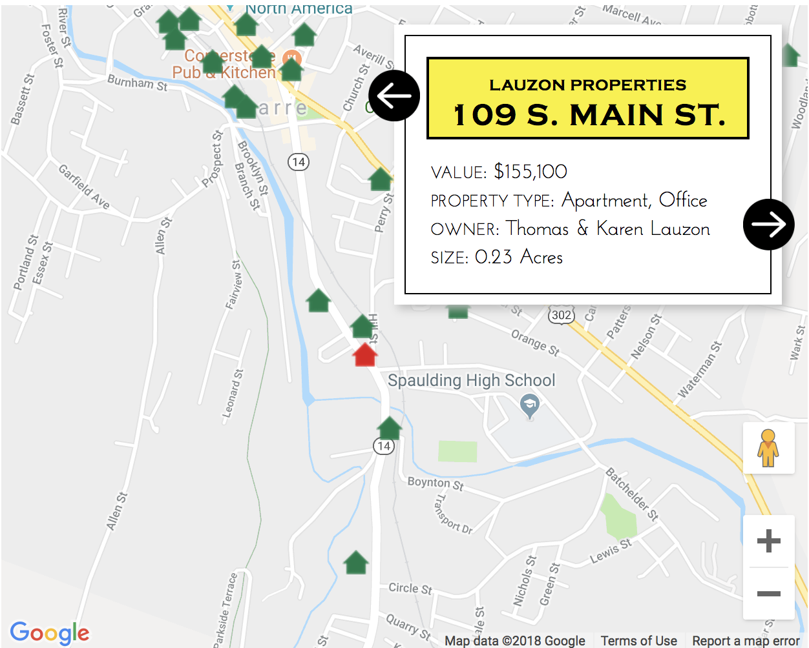

To find out how much property developer Thom Lauzon owned in Barre, the city where he was mayor, we turned to property records and the state's database of LLCs. We discovered that he and his wife owned properties totaling nearly two percent of the city's grand list. I mapped all of those properties to accompany the story "[Thom Lauzon Is Barre's Mayor — and Its Biggest Developer. Is That a Problem?](https://www.sevendaysvt.com/vermont/thom-lauzon-is-barres-mayor-and-its-biggest-developer-is-that-a-problem/Content?oid=7863749)."

Data source: Vermont Secretary of State Business Registry; Barre City Grand List

Screenshot:

