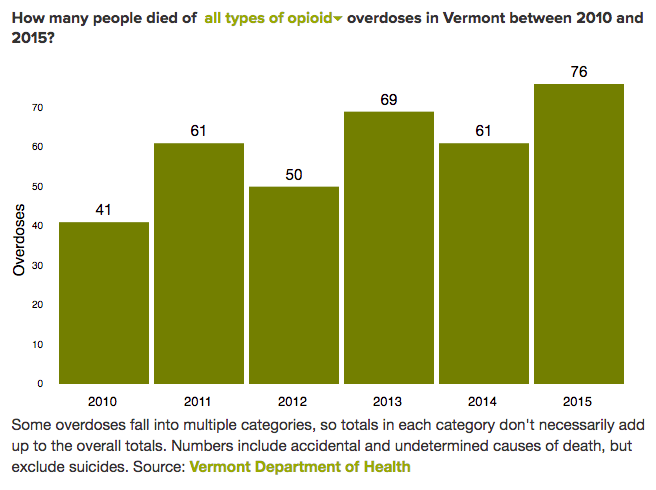

A drop-down D3 chart breaking down overdose deaths in Vermont between 2010 and 2015. Appears in the story "[Brothers' Keeper: A Mom Wants a Dealer to Pay for Her Sons' Overdose Deaths](http://www.sevendaysvt.com/vermont/brothers-keeper-a-mom-wants-a-dealer-to-pay-for-her-sons-overdose-deaths/Content?oid=3633380)." Also see a working demo [here](http://bl.ocks.org/asuozzo/942b51a87c3d605449cd482f963dc979).

