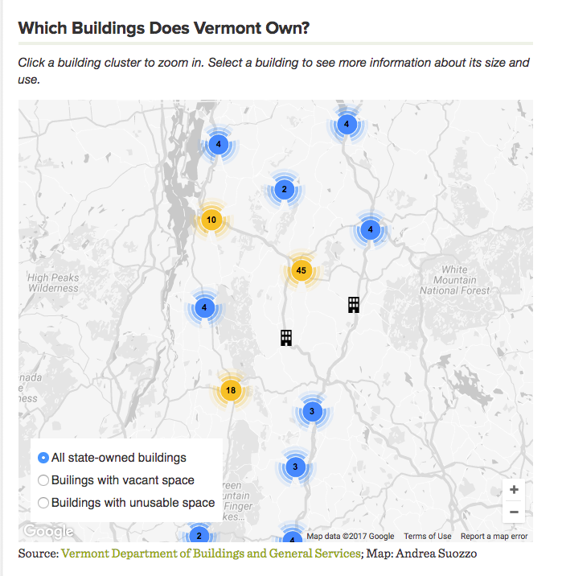

A cluster map of property owned by the state of Vermont, with information on how large each building is, which agencies use it, and how much space is not used. The user can filter the map to show only properties that have vacant or unusable space. The map originally appeared on the story "[Office Politics: Juggling 3.2 Million Square Feet of Space](https://www.sevendaysvt.com/vermont/office-politics-juggling-32-million-square-feet-of-space/Content?oid=6096356#mapContainer)."

To run this project locally, create a Google Maps Javascript API key and paste it into index.html to replace `[API KEY]`.

Data source: Vermont Department of Buildings and General Services
Building icon source: The Noun Project
Cluster icon source: Google

Screenshot:

